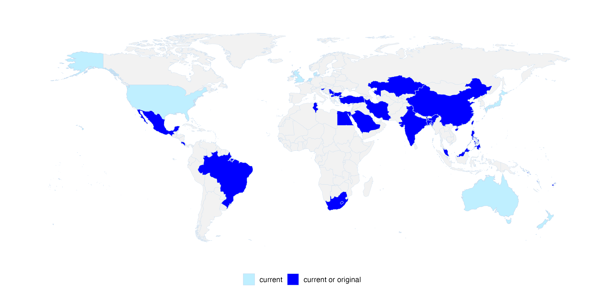

# Open Science in Developing Countries: A Collection of Practical Guides

## About

This is a collaborative project that will collect practical experiences and guides related to open science in developing countries. The direct output of this project will be a collaborative paper for the journal [Advances in Methods and Practices in Psychological Science (AMPPS)](https://www.psychologicalscience.org/publications/ampps). Ultimately, we hope this project will accelerate international collaborations, especially those between researchers from developing countries. Also, we hope the practical guides will help researchers in developing countries to promote and implement open science practices in psychological science and related fields.

This project is partnered with [the Chinese Open Science Network](https://open-sci.cn/) and [FORRT](https://forrt.org/)

### Contact

Dr. Hu Chuan-Peng, School of Psychology, Nanjing Normal University, Nanjing, China. Email: hcp4715 AT hotmail DOT com.

## Contributors

-   45 researchers contributed their perspectives of open science from 20 developing countries/regions and synthesized this practical guide.

<!-- insert the png figure here: -->

## Progress

-   [x] Open call for contributors.

-   [x] Identified topic leads.

-   [x] Drafts for each topic.

-   [x] First draft of the whole paper.

-   [x] Restructure the first draft of the whole paper.

-   [x] Final draft of the whole paper and polishing the figures.

-   [x] Internal Review. We thank the following researchers for their valuable comments and suggestions: Dr. [Chris Graham](https://www.researchgate.net/profile/Chris-Graham-17), Dr. [Crystal Steltenpohl](https://cnsyoung.com/)

-   [x] [Preprint](http://osf.io/7ubk2) & Submission (2025-03-03).

-   [x] Revision (2025-05 to 2025-06). We thank the following early career researchers for their suggestions on the readability of this work: Yi-Ling Zhang, Jiawei Zhao, and Ziyang Zhao.

## Conference presentations
-   2025-06-27 \| SIPS 2025, Budapest, Hungary, Unconference: "A Collection of Practical Guides for Adopting Open Science Practices in Resource-Limited Settings"
-   2024-06-10 \| SIPS 2024, Nairobi, Kenya, Hackathon: "Promoting Open Science in Developing Countries: A Practical Guide"
-   2023-10-23 \| Big Team Science Conference 2023 (online) \| \# 24 Featured Panel. See program [here](https://bigteamscienceconference.github.io/program/).

<!-- env: run directly on Macbook Pro-->
